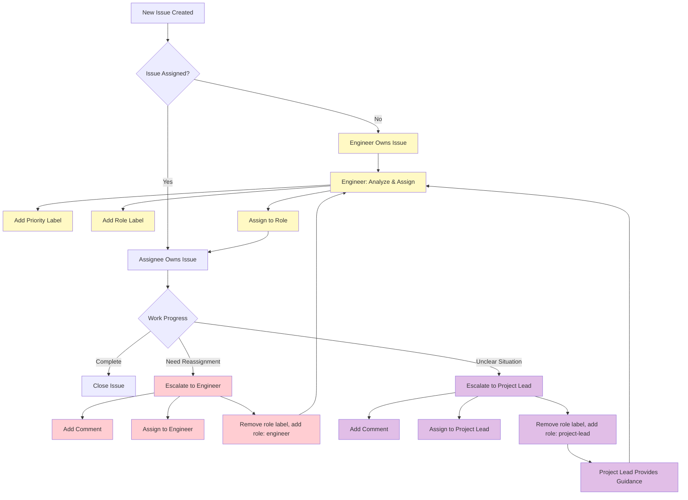

# GitHub Issue Assignment and Workflow

## Overview

This document defines the workflow for issue assignment, priority management, and role-based ownership using GitHub labels. The workflow ensures clear ownership, proper escalation, and controlled label management.

## Core Principles

1. **Engineer-Only Assignment**: Only Engineers can assign priority and role labels to new issues
2. **Single Label Constraint**: Each issue can have at most one priority label and one role label
3. **Clear Ownership**: The assignee owns the issue and is responsible for its completion
4. **Escalation Process**: Issues requiring reassignment must be escalated to Engineers

## Workflow Rules

### 1. New Issue Creation

#### For All Roles (except Engineer):
- Create issue with description and requirements
- **DO NOT** add any priority labels
- **DO NOT** add any role labels
- Leave the issue unassigned

#### For Engineer Role:
- Create issue with description and requirements
- Add appropriate priority label (see Priority Labels section)
- Add appropriate role label (see Role Labels section)
- Assign issue to the appropriate role

### 2. Issue Assignment Process

#### Engineer Responsibilities:
- Monitor new unassigned issues
- For each new unassigned issue:
  - Analyze requirements and complexity
  - Assign appropriate priority label
  - Assign appropriate role label
  - Assign issue to the designated role
- Maintain only one priority and one role label per issue

#### Other Roles Responsibilities:
- Work on assigned issues according to priority
- Do not change priority or role labels
- Escalate issues requiring reassignment (see Escalation Process)

### 3. Label Management

#### Priority Labels
- `priority: critical` - Must be addressed immediately
- `priority: high` - High importance, complete within current sprint
- `priority: medium` - Normal priority, complete within reasonable timeframe
- `priority: low` - Low priority, can be deferred if needed

#### Role Labels
- `role: developer` - Feature implementation, bug fixes, unit/integration tests
- `role: tester` - Test execution, result recording, validation
- `role: test-author` - E2E testing, test framework, regression suites
- `role: engineer` - Releases, branch management, workflow coordination
- `role: general` - Coordination, monitoring, defaults
- `role: project-lead` - Strategic guidance, conflict resolution, process exceptions

#### Label Constraints:
- **Single Priority**: Only one priority label allowed per issue
- **Single Role**: Only one role label allowed per issue
- **Engineer Control**: Only Engineers can add/change priority and role labels

### 4. Escalation Process

#### When to Escalate:
- Issue requires different priority level
- Issue should be assigned to different role
- Issue is blocked and needs reassignment
- Issue scope has changed significantly

#### Escalation Procedure:
1. **Current Owner**: Add comment explaining need for reassignment
2. **Current Owner**: Assign issue to Engineer
3. **Current Owner**: Remove existing role label and add `role: engineer` label
4. **Current Owner**: Keep issue open (do not close)
5. **Engineer**: Re-evaluate priority and role assignment
6. **Engineer**: Update labels and reassign if needed

#### Escalation Label Usage:
- Other roles can **only** add `role: engineer` label when escalating
- No other role or priority labels can be added by non-Engineer roles
- When escalating, remove any existing role label and add `role: engineer` label

### 6. Project Lead Escalation

#### When to Escalate to Project Lead:
- Unclear requirements or acceptance criteria
- Conflicting priorities that need resolution
- Process exceptions or edge cases not covered by workflow
- Resource allocation decisions needed
- Strategic direction questions

#### Project Lead Escalation Procedure:
1. **Engineer**: Add comment explaining the unclear situation and specific guidance needed
2. **Engineer**: Assign issue to Project Lead (GitHub user)
3. **Engineer**: Remove existing role label and add `role: project-lead` label
4. **Project Lead**: Review and provide clear guidance/resolution
5. **Project Lead**: Update labels and reassign to appropriate role

#### Project Lead Responsibilities:
- Provide clear guidance on unclear situations
- Resolve priority conflicts
- Make strategic decisions
- Approve process exceptions
- Ensure project alignment with goals

### 7. Ownership Model

#### Assigned Issues:
- **Assignee** owns the issue
- Responsible for completion according to priority
- Must escalate if unable to complete or if reassignment needed

#### Unassigned Issues:
- **Engineer** owns the issue
- Responsible for initial assignment and prioritization
- Must assign to appropriate role within reasonable timeframe

## Workflow Diagram



## Role-Specific Guidelines

### Developer (`role: developer`)
- Creates feature branches from `development`
- Implements features and bug fixes
- Writes unit and integration tests for their features
- Opens PRs targeting `development`
- Ensures tests pass and documentation is updated
- **DO NOT** modify priority or role labels
- Escalate issues requiring reassignment to Engineer

### Tester (`role: tester`)
- Executes test suites on any branch (`dev/X`, `development`, `main`)
- Records test results and evidence in issues
- Validates acceptance criteria
- Reports bugs and issues
- **DO NOT** modify priority or role labels
- Escalate issues requiring reassignment to Engineer

### Test Author (`role: test-author`)
- Creates E2E tests and regression suites
- Maintains test framework and infrastructure
- Designs complex test scenarios spanning multiple features
- Handles performance, security, and cross-browser testing
- **DO NOT** modify priority or role labels
- Escalate issues requiring reassignment to Engineer

### Engineer (`role: engineer`)
- Monitors unassigned issues
- Assigns priority and role labels to new issues
- Handles escalations and reassignments
- Manages releases and tags
- Enforces branch protections and quality gates
- Maintains label integrity across all issues

### General (`role: general`)
- Coordinates workflow between roles
- Monitors system progress and health
- Handles unknown or unassigned issue types
- Provides default behavior when specific roles are unavailable
- **DO NOT** modify priority or role labels
- Escalate issues requiring reassignment to Engineer

### Project Lead (`role: project-lead`)
- Provides strategic guidance and direction
- Resolves priority conflicts and resource allocation
- Makes decisions on process exceptions
- Ensures project alignment with overall goals
- Reviews and approves escalations requiring human judgment
- Updates labels and reassigns issues after providing guidance

## Status Tracking

All issues use the standard status labels:
- `status: inbox` - New issue awaiting processing
- `status: in progress` - Currently being worked on
- `status: review` - Ready for review/validation
- `status: done` - Completed and validated

## Label Change Procedures

### Changing Priority:
1. Remove existing priority label
2. Add new priority label
3. Ensure only one priority label remains

### Changing Role:
1. Remove existing role label
2. Add new role label
3. Ensure only one role label remains
4. Update assignee if needed

### Escalation Label Change:
1. Remove existing role label
2. Add `role: engineer` label
3. Assign issue to Engineer

## Usage Examples

### Creating a Feature Implementation Issue (Non-Engineer)
```
Title: [REQ-001] Implement Obsidian task integration
Description: Detailed requirements...
DO NOT add priority or role labels
Leave unassigned
```

### Engineer Assignment Process
```
Engineer reviews unassigned issue
Adds: priority: high
Adds: role: developer
Assigns to Developer role
```

### Escalation Example
```
Current Owner: Issue requires higher priority due to blocking other work
Action: Add comment explaining need
Action: Assign issue to Engineer
Action: Remove current role label, add role: engineer
```

### Creating a Release Coordination Issue (Engineer)
```
Title: Prepare v1.1.0 release
Adds: priority: high
Adds: role: engineer
Assigns to Engineer role
```

### Project Lead Escalation Example
```
Engineer: Requirements unclear for feature implementation
Action: Add comment explaining specific guidance needed
Action: Assign issue to Project Lead
Action: Remove current role label, add role: project-lead
```

## GitFlow Integration

### Branch Strategy
- `main`: releases only (tagged by Engineers)
- `development`: integration branch for merged bugfixes/enhancements
- `dev/X`: ephemeral branches for active work

### Permissions
- **Developers**: push only to `dev/X`; open PRs to `development`
- **Test Authors & Engineers**: may push/merge to `development`
- **Engineers**: only role that merges to `main` and creates tags
- **Testers**: may test any branch

### Traceability
- Commits and PRs reference the Issue (`Closes #123`)
- Releases reference closed Issues
- All changes tied to GitHub Issues with priority and acceptance criteria

## Compliance and Enforcement

- All roles must follow these workflow rules
- Engineers are responsible for workflow enforcement
- Regular audits of label usage and assignment patterns
- PROJECT_REQUIREMENTS.md is the source of truth for requirements

## Benefits

1. **Clear Ownership**: Every issue has a clear owner
2. **Controlled Prioritization**: Consistent priority assignment
3. **Proper Escalation**: Structured process for reassignment
4. **Label Integrity**: Clean, meaningful label usage
5. **Engineer Oversight**: Centralized control for workflow consistency
6. **Flexibility**: Not limited to GitHub user assignments
7. **Clarity**: Clear role-based assignment system
8. **Traceability**: Easy to filter and search by role

## Related Documentation

- [Continue Rules](../.continue/rules/) - Role-specific guidelines and constraints
- [Project Requirements](../PROJECT_REQUIREMENTS.md) - Source of truth for requirements