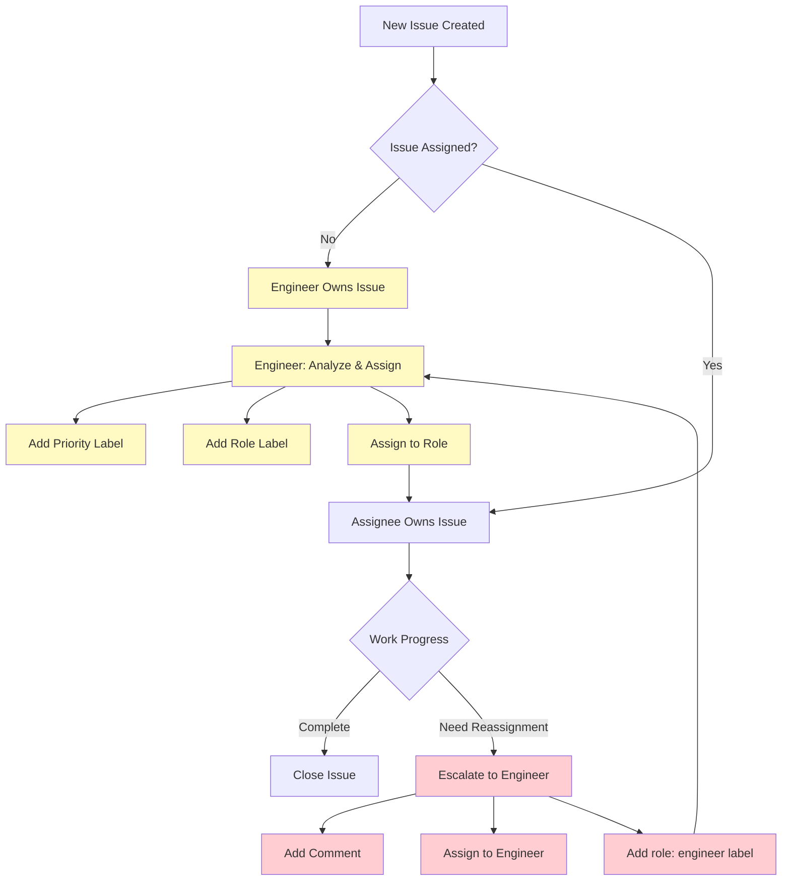

# Issue Assignment and Priority Management Workflow

## Overview

This document defines the workflow for issue assignment, priority management, and role-based ownership in the multi-agent system. The workflow ensures clear ownership, proper escalation, and controlled label management.

## Core Principles

1. **Engineer-Only Assignment**: Only Engineers can assign priority and role labels to new issues
2. **Single Label Constraint**: Each issue can have at most one priority label and one role label
3. **Clear Ownership**: The assignee owns the issue and is responsible for its completion
4. **Escalation Process**: Issues requiring reassignment must be escalated to Engineers

## Workflow Rules

### 1. New Issue Creation

#### For All Roles (except Engineer):
- Create issue with description and requirements
- **DO NOT** add any priority labels
- **DO NOT** add any role labels
- Leave the issue unassigned

#### For Engineer Role:
- Create issue with description and requirements
- Add appropriate priority label (see Priority Labels section)
- Add appropriate role label (see Role Labels section)
- Assign issue to the appropriate role

### 2. Issue Assignment Process

#### Engineer Responsibilities:
- Monitor new unassigned issues
- For each new unassigned issue:
  - Analyze requirements and complexity
  - Assign appropriate priority label
  - Assign appropriate role label
  - Assign issue to the designated role
- Maintain only one priority and one role label per issue

#### Other Roles Responsibilities:
- Work on assigned issues according to priority
- Do not change priority or role labels
- Escalate issues requiring reassignment (see Escalation Process)

### 3. Label Management

#### Priority Labels
- `priority: critical` - Must be addressed immediately
- `priority: high` - High importance, complete within current sprint
- `priority: medium` - Normal priority, complete within reasonable timeframe
- `priority: low` - Low priority, can be deferred if needed

#### Role Labels
- `role: developer` - Feature implementation, bug fixes
- `role: tester` - Test execution, result recording
- `role: test-author` - Test creation, test design
- `role: engineer` - Analysis, job generation, releases
- `role: general` - Coordination, monitoring, defaults

#### Label Constraints:
- **Single Priority**: Only one priority label allowed per issue
- **Single Role**: Only one role label allowed per issue
- **Engineer Control**: Only Engineers can add/change priority and role labels

### 4. Escalation Process

#### When to Escalate:
- Issue requires different priority level
- Issue should be assigned to different role
- Issue is blocked and needs reassignment
- Issue scope has changed significantly

#### Escalation Procedure:
1. **Current Owner**: Add comment explaining need for reassignment
2. **Current Owner**: Assign issue to Engineer
3. **Current Owner**: Keep issue open (do not close)
4. **Engineer**: Re-evaluate priority and role assignment
5. **Engineer**: Update labels and reassign if needed

#### Escalation Label Usage:
- Other roles can **only** add `role: engineer` label when escalating
- No other role or priority labels can be added by non-Engineer roles
- When escalating, remove any existing role label and replace with `role: engineer`

### 5. Ownership Model

#### Assigned Issues:
- **Assignee** owns the issue
- Responsible for completion according to priority
- Must escalate if unable to complete or if reassignment needed

#### Unassigned Issues:
- **Engineer** owns the issue
- Responsible for initial assignment and prioritization
- Must assign to appropriate role within reasonable timeframe

## Workflow Diagram

## Role-Specific Guidelines

### Developer Role
- Focus on assigned development tasks
- Do not modify priority or role labels
- Escalate if task requires different priority or role

### Tester Role
- Execute assigned test cases
- Do not modify priority or role labels
- Escalate if testing scope changes

### Test Author Role
- Create assigned test scenarios
- Do not modify priority or role labels
- Escalate if test framework changes needed

### General Role
- Handle coordination tasks
- Do not modify priority or role labels
- Escalate if coordination scope changes

### Engineer Role
- Monitor unassigned issues
- Assign priority and role labels
- Handle escalations and reassignments
- Maintain label integrity

## Label Change Procedure

### Changing Priority:
1. Remove existing priority label
2. Add new priority label
3. Ensure only one priority label remains

### Changing Role:
1. Remove existing role label
2. Add new role label
3. Ensure only one role label remains
4. Update assignee if needed

### Escalation Label Change:
1. Remove existing role label
2. Add `role: engineer` label
3. Assign issue to Engineer

## Compliance and Enforcement

- All agents must follow these workflow rules
- Orchestrator will validate label usage
- Engineers are responsible for workflow enforcement
- Regular audits of label usage and assignment patterns

## Benefits

1. **Clear Ownership**: Every issue has a clear owner
2. **Controlled Prioritization**: Consistent priority assignment
3. **Proper Escalation**: Structured process for reassignment
4. **Label Integrity**: Clean, meaningful label usage
5. **Engineer Oversight**: Centralized control for workflow consistency