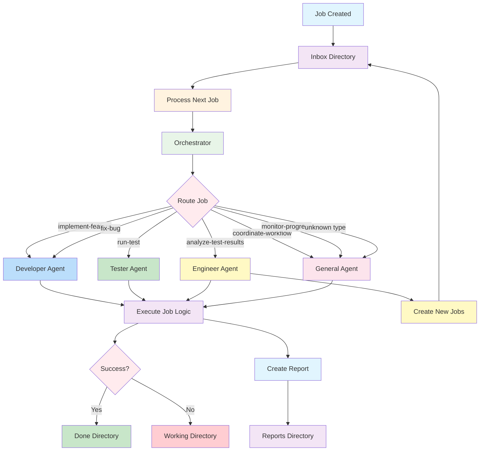

# Job Processing Workflow Diagram

## Overview

## Detailed Flow

### 1. Job Creation
- Jobs are created as JSON files in `ops/jobs/inbox/`
- Files are processed in lexicographical order
- Each job contains metadata and specifications

### 2. Job Processing
- `scripts/process_next_job.js` is executed
- The script reads the highest-priority job from inbox
- Required files are created as stubs if missing

### 3. Agent Routing
- Orchestrator analyzes job type and properties
- Routes to appropriate agent based on role labels:
 - **Developer** (`role: developer`): Feature implementation, bug fixes
 - **Tester** (`role: tester`): Test execution, result recording
 - **Engineer** (`role: engineer`): Test analysis, job generation
 - **General** (`role: general`): Coordination, monitoring, defaults

### 4. Job Execution
- Agent-specific logic is executed
- Results are captured and processed
- Any created files are tracked

### 5. Result Handling
- Success: Job moved to `ops/jobs/done/`
- Failure: Job moved to `ops/jobs/working/` for retry
- Report created in dated directory under `ops/reports/`

### 6. Follow-up Actions
- Engineer agent may create new jobs based on analysis
- New jobs are placed back in inbox for processing
- Continuous workflow until all jobs are completed

## File Structure

`
ops/
├── jobs/
│   ├── inbox/           # New jobs waiting processing
│   ├── working/         # Jobs being retried after failure
│   └── done/           # Successfully completed jobs
└── reports/
    └── YYYY-MM-DD/     # Dated report directories
        └── summary.jsonl  # Job execution logs

scripts/
└── agents/
    ├── orchestrator.js  # Job routing logic
    ├── developer.js     # Feature/bug implementation
    ├── tester.js        # Test execution
    ├── engineer.js      # Analysis and job generation
    └── general.js       # Coordination and defaults
`

## Error Recovery

- Failed jobs remain in working directory
- Manual intervention may be required
- System continues processing other jobs
- Detailed error information in reports