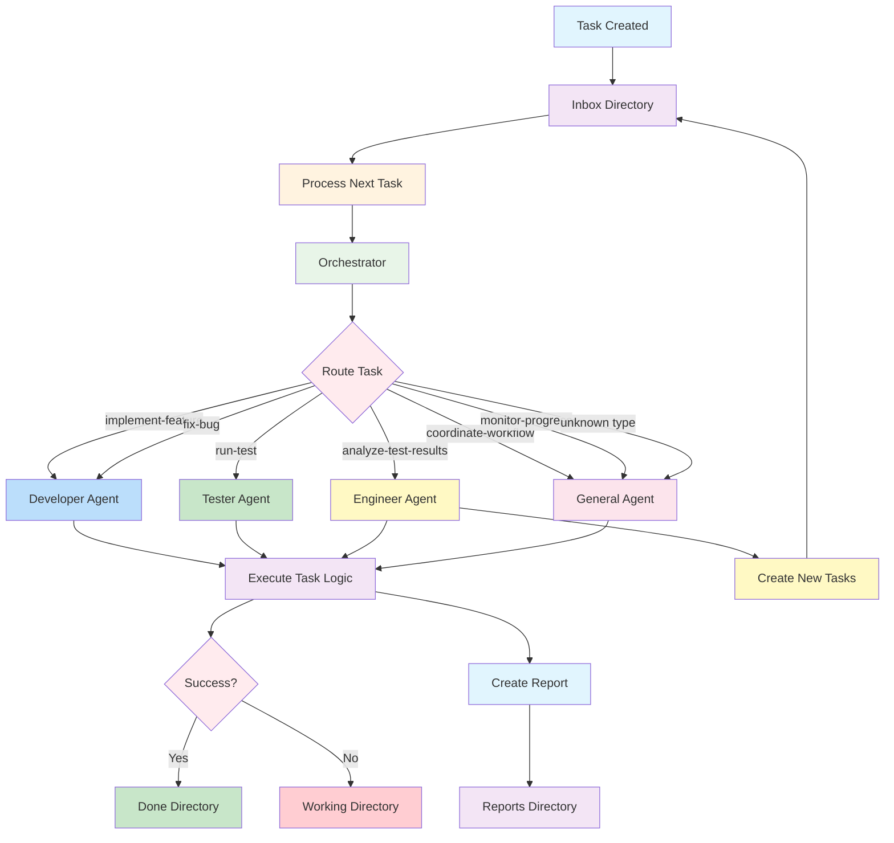

# Task Processing Workflow Diagram

## Overview

## Detailed Flow

### 1. Task Creation
- Tasks are created as JSON files in `ops/tasks/inbox/`
- Files are processed in lexicographical order
- Each task contains metadata and specifications

### 2. Task Processing
- `scripts/process_next_task.js` is executed
- The script reads the highest-priority task from inbox
- Required files are created as stubs if missing

### 3. Agent Routing
- Orchestrator analyzes task type and properties
- Routes to appropriate agent:
 - **Developer**: Feature implementation, bug fixes
 - **Tester**: Test execution, result recording
 - **Engineer**: Test analysis, task generation
 - **General**: Coordination, monitoring, defaults

### 4. Task Execution
- Agent-specific logic is executed
- Results are captured and processed
- Any created files are tracked

### 5. Result Handling
- Success: Task moved to `ops/tasks/done/`
- Failure: Task moved to `ops/tasks/working/` for retry
- Report created in dated directory under `ops/reports/`

### 6. Follow-up Actions
- Engineer agent may create new tasks based on analysis
- New tasks are placed back in inbox for processing
- Continuous workflow until all tasks are completed

## File Structure

`
ops/
├── tasks/
│   ├── inbox/           # New tasks waiting processing
│   ├── working/         # Tasks being retried after failure
│   └── done/           # Successfully completed tasks
└── reports/
    └── YYYY-MM-DD/     # Dated report directories
        └── summary.jsonl  # Task execution logs

scripts/
└── agents/
    ├── orchestrator.js  # Task routing logic
    ├── developer.js     # Feature/bug implementation
    ├── tester.js        # Test execution
    ├── engineer.js      # Analysis and task generation
    └── general.js       # Coordination and defaults
`

## Error Recovery

- Failed tasks remain in working directory
- Manual intervention may be required
- System continues processing other tasks
- Detailed error information in reports"
